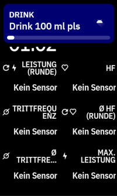
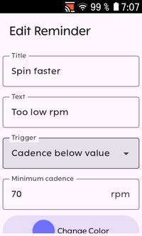

# Karoo Reminder Extension

Karoo extension that displays in-ride alerts based on custom triggers. Reminders can be set to activate after a specific time interval, distance traveled, or when a sensor value is outside a defined range (e.g., heart rate exceeds zone 2).

## Installation

If you are using a Karoo 3, you can use [Hammerhead's sideloading procedure](https://support.hammerhead.io/hc/en-us/articles/31576497036827-Companion-App-Sideloading) to install the app:

1. Open the [releases page](https://github.com/timklge/karoo-reminder/releases) on your phone's browser, long-press the `app-release.apk` link and share it with the Hammerhead Companion app.
2. Your karoo should show an info screen about the app now. Press "Install".

If you are using a Karoo 2, you can use manual sideloading:

1. Download the apk from the [releases page](https://github.com/timklge/karoo-reminder/releases) (or build it from source)
2. Set up your Karoo for sideloading. DC Rainmaker has a great [step-by-step guide](https://www.dcrainmaker.com/2021/02/how-to-sideload-android-apps-on-your-hammerhead-karoo-1-karoo-2.html).
3. Install the app by running `adb install app-release.apk`.

## Credits

- Icon is `timers` by [boxicons.com](https://boxicons.com) (MIT-licensed).
- Reminder sound played over bluetooth is `SweetAlertSound5.wav` by `KIZILSUNGUR` from [freesound.org](https://freesound.org/people/KIZILSUNGUR/sounds/72129/) (CC0).

## Links

[karoo-ext source](https://github.com/hammerheadnav/karoo-ext)
